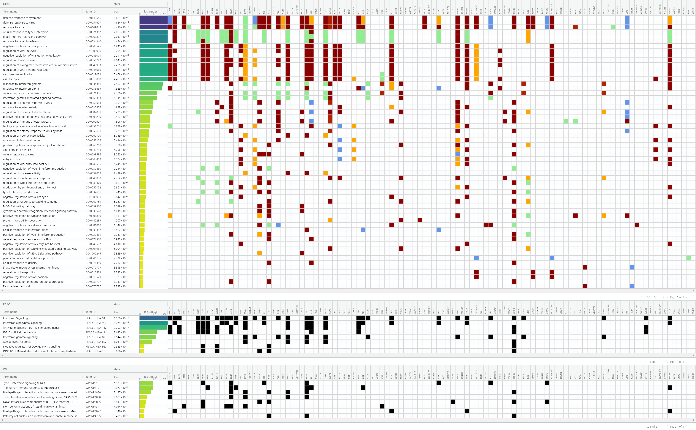
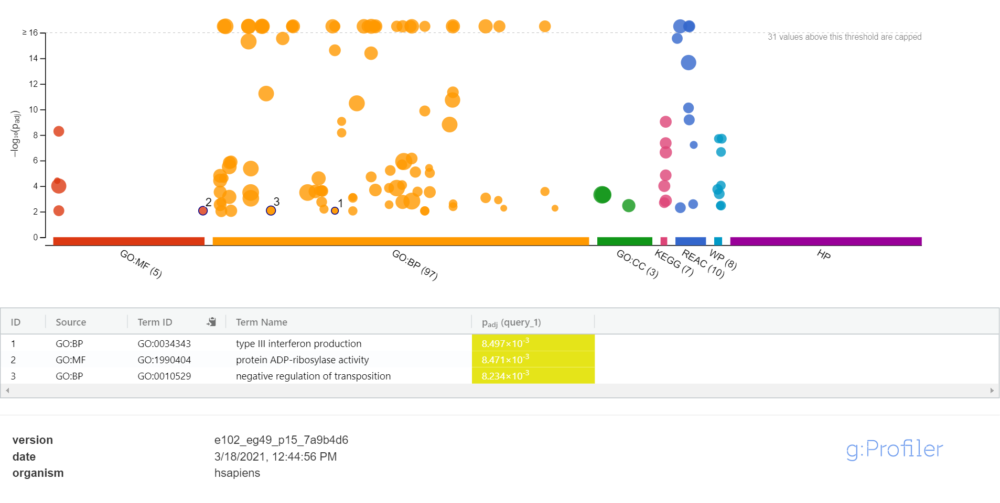
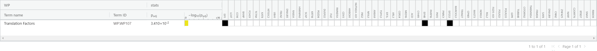
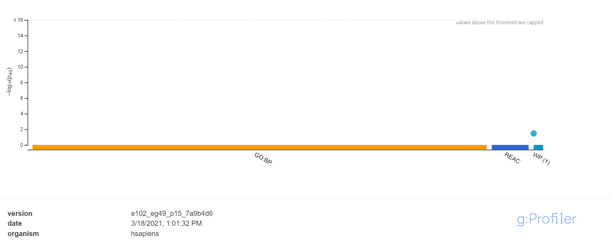
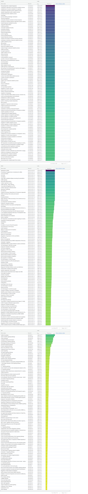

```{r include=FALSE, message=FALSE, warning=FALSE}

if (!requireNamespace("BiocManager", quietly = TRUE))
    install.packages("BiocManager")
#if (!requireNamespace("org.Hs.eg.db", quietly = TRUE))
   # BiocManager::install("org.Hs.eg.db")
if (!requireNamespace("knitr", quietly = TRUE))
    install.packages("knitr")
if (!requireNamespace("biomaRt", quietly = TRUE))
    BiocManager::install("biomaRt")
if (!requireNamespace("edgeR", quietly = TRUE))
    BiocManager::install("edgeR")
if (!requireNamespace("dplyr", quietly = TRUE))
    install.packages("dplyr")
if (!requireNamespace("ggplot2", quietly = TRUE))
    install.packages("ggplot2")
if (!requireNamespace("GEOquery", quietly = TRUE))
    install.packages("GEOquery")
if (!requireNamespace("ComplexHeatmap", quietly = TRUE))
    BiocManager::install("ComplexHeatmap")
if (!requireNamespace("circlize", quietly = TRUE))
    install.packages("circlize")

# packages
library(edgeR)
library(limma)
library(GEOquery)
library(knitr)
library(biomaRt)
library(ggplot2)
library(dplyr)
library(ComplexHeatmap)
library(circlize)
library(Biobase)
```


```{r}
# load cleaned and normalized dataset

dge <- readRDS("cleaned_data.Rds")
```


# Assignment 1 Recap

# Dataset information

```{r, message=FALSE, warning=FALSE, results=TRUE}
gse <- getGEO("GSE149050",GSEMatrix=FALSE)
data.frame(head(Meta(gse)))
```


```{r, message=FALSE, warning=FALSE}
suppFiles = GEOquery::getGEOSuppFiles('GSE149050')
fnames = rownames(suppFiles)
exprDat = read.delim(fnames[1],header=TRUE,
                    check.names = FALSE)

```

The dimensions of my dataset are: `r dim(exprDat)`. There are thus 56269 genes and 288 samples in my dataset, ignoring the first column as it just tells us that the rows are gene names.

In my dataset, there are two kinds of samples based on the study description. The first kind of sample is IFNneg and the second kind of sample is IFNpos. IFpos represents presence of interferon response signature and IFneg represents the healthy control group.

Healthy control group: 85
Systemic lupus erythamtosus (SLE): 203
To recap the previous assignment, let's create an MDS plot to visualize our normalized data.


```{r}
normCountData <- cpm(dge)
limma::plotMDS(normCountData, col = rep(c("darkgreen", "blue"), 288), main = "Systemic lupus erythamtosus (SLE) vs Healthy patients")
```


Great!So it looks like we can see two main clusters on the left and the right. It also looks like we can see that there are two sub clusters on the left but let's get to some differential analysis to look more into it!

# Differential Gene Analysis

## Heatmaps

Due to the large size of the matrix for my dataset, I will first find the top 10000 most deferentially expressed genes and then visualize a heatmap from that.

```{r, warning=FALSE, message=FALSE, echo=FALSE}

heatmapMat <- t(scale(t(normCountData)))

```
```
if (min(heatmapMat) == 0){
  heatmap_col = colorRamp(c(0, max(heatmapMat)),
  c("white", "red"))
} else {
  heatmap_col = colorRamp2(c(min(heatmapMat), 0, max(heatmapMat)), c("blue", "white", "red"))
}

current_heatmap <- Heatmap(as.matrix(heatmapMat),
                           show_row_dend = TRUE, show_column_dend = TRUE,
                           col=heatmap_col, show_column_names = TRUE,
                           show_row_names = FALSE, show_heatmap_legend=TRUE, use_raster = TRUE)
current_heatmap
```

I can't really see the differences between the healthy control and SLE genes. From the MDS at least we can see some sort of clustering between the two groups.

## Model


First I want to create groups for my model. In my dataset, I have 3 groups- one for Pos/Neg disease state groups respectively and one for healthy control group. 

```{r warning=FALSE, message=FALSE, echo=FALSE}
samples <- data.frame(lapply(colnames(normCountData)[1:288], FUN=function(x){unlist(strsplit(x, split = "\\_"))[c(1,3)]}))
colnames(samples) <- colnames(normCountData)[1:288]
rownames(samples) <- c("patients","cell_type")
samples <- data.frame(t(samples))
```

### Limma Analysis

I first need to create the model design matrix I wish to use.

```{r warning=FALSE, message=FALSE, echo=FALSE}
model_design <- model.matrix(~ samples$cell_type )

expressionMatrix <- as.matrix(normCountData)
minimalSet <- ExpressionSet(assayData=expressionMatrix) #biobase function
#Fit our data to the above model
fit <- lmFit(minimalSet, model_design)
```


Now, I will apply the empirical Bayes method to calculate a differential expression for the model we just created.

```{r warning=FALSE, message=FALSE, echo=FALSE}
fit2 <- eBayes(fit,trend=TRUE)

topfit <- topTable(fit2,                    
                   coef=ncol(model_design),                   
                   adjust.method = "BH",                   
                   number = nrow(expressionMatrix))

output_hits <- topfit[order(topfit$P.Value),]
```

Okay, so now we have a list of the top significantly differentially expressed genes. Let's view these in a table!

```{r warning=FALSE, message=FALSE, echo=FALSE}
kable(output_hits[1:10,],type="html",row.names = TRUE)
```


It looks like `r length(which(output_hits$P.Value < 0.05))` genes pass the 0.05 p-threshold value and `r length(which(output_hits$adj.P.Val < 0.05))` genes pass correction- so honestly, not a lot! I used the Benjamin-Hochberg adjustment method as it is not as stringent as Bonferroni adjustment method and is still accepted and commonly used in scientific studies so I'm curious to see how adding patient confounder can contribute to the addition or removal of genes that pass correction.

#### Multiple Hypothesis Testing

In lecture it is recommended to also check and add the patient as a confounding variable to the design matrix. I'm going to try that here and see what comes up!

```{r warning=FALSE, message=FALSE, echo=FALSE}
model_design_pat <- model.matrix(~ samples$cell_type + samples$patients)

#Fit our data to the above model
# fit_pat <- lmFit(minimalSet, model_design_pat) <- COMMENTED OUT AS IT RESULTS IN AN ERROR

```


Okay so it looks like I am getting an error where patients are not an estimable coefficient for patients 208 and 262 when I try to fit the data to the patient variability accounted model. Thus, I think that the original model used is sufficient for the purpose of this analysis

Now I want to visualize the top hits using Limma analysis by creating that original heatmap but only for the significant genes!

```{r fig.width= 35, fig.height=35}
top_hits <- rownames(dplyr::filter(output_hits, adj.P.Val < 0.01))
heatmap_matrix_tophits <- t(
scale(t(heatmapMat[
which(rownames(heatmapMat) %in% top_hits),])))

heatmap_matrix_tophits<- heatmap_matrix_tophits[,c(grep(colnames(heatmap_matrix_tophits),pattern = "IFNpos"),         grep(colnames(heatmap_matrix_tophits),pattern = "IFNneg"))]
if(min(heatmap_matrix_tophits) == 0){
heatmap_col = colorRamp2(c( 0, max(heatmap_matrix_tophits)),
c( "white", "red"))
} else {
  heatmap_col = colorRamp2(c(min(heatmap_matrix_tophits), 0, max(heatmap_matrix_tophits)), c("blue", "white", "red"))
}
current_heatmap_clean <- Heatmap(as.matrix(heatmap_matrix_tophits),
cluster_rows = TRUE,
cluster_columns = FALSE,
show_row_dend = TRUE,
show_column_dend = FALSE,
col=heatmap_col,
show_column_names = TRUE,
show_row_names = FALSE,
show_heatmap_legend = TRUE,
column_names_gp = gpar(fontsize=15),
heatmap_legend_param = list(
    at = c(-2, 0, 2),
    labels = c("low", "zero", "high"),
    title = "High to Low Significance",
    legend_height = unit(10, "cm"),
    title_position = "lefttop-rot"
))

current_heatmap_clean
```
Okay, so definitely hard to read since there are 288 samples but, it looks like there is some clustering going on...

### EdgeR Analysis

Since edgeR is commonly used for bulk RNA sequencing data I am using it here. I have a feeling that this will result in more genes passed for correction but we'll see!

First, let's estimate dispersion


```{r warning=FALSE, message=FALSE, echo=FALSE}

dge <- DGEList(counts=normCountData, group=samples$cell_type)

disp <- estimateDisp(dge, model_design)

fit <- glmQLFit(disp, model_design)

qlf.pos_vs_neg <- glmQLFTest(fit, coef=colnames(fit$coefficients)[3])
kable(topTags(qlf.pos_vs_neg), type="html")

```

Alright, let's look at some differentially expressed genes!

```{r warning=FALSE, message=FALSE, echo=FALSE}
qlfOutputHits <- topTags(qlf.pos_vs_neg,sort.by = "PValue", n = nrow(normCountData))
length(which(qlfOutputHits$table$PValue < 0.05))
length(which(qlfOutputHits$table$FDR < 0.05)) #FDR is adjusted p-values
```


Alright so `r length(which(qlfOutputHits$table$PValue < 0.05))` passed the significance of 0.05. and `r length(which(qlfOutputHits$table$FDR < 0.05))` passed for correction (BH method).


Let's make a heatmap for the edgeR analysis and see what we can glean from it.


```{r fig.width=35, fig.height=35}
top_hits <- rownames(qlfOutputHits$table)[qlfOutputHits$table$FDR<0.01] 
heatmap_matrix_tophits <- t(
  scale(t(heatmapMat[which(rownames(heatmapMat) %in% top_hits),]))) 
heatmap_matrix_tophits<- heatmap_matrix_tophits[,c(grep(colnames(heatmap_matrix_tophits),pattern = "IFNpos"),         grep(colnames(heatmap_matrix_tophits),pattern = "IFNneg"))]
if(min(heatmap_matrix_tophits) == 0){
    heatmapCol = colorRamp2(c( 0, max(heatmap_matrix_tophits)), 
                             c( "white", "red"))
  } else {
    heatmapCol = colorRamp2(c(min(heatmap_matrix_tophits), 0, max(heatmap_matrix_tophits)), c("blue", "white", "red"))
  }
currHeatmap_clean <- Heatmap(as.matrix(heatmap_matrix_tophits),
                           cluster_rows = TRUE,
                           cluster_columns = FALSE,
                           show_row_dend = TRUE,
                           show_column_dend = FALSE,
                           col=heatmapCol,
                           show_column_names = TRUE, 
                           show_row_names = FALSE,
                           show_heatmap_legend = TRUE,
                           column_names_gp = gpar(fontsize=15),
                           heatmap_legend_param = list(
                                 at = c(-2, 0, 2),
                                 labels = c("low", "zero", "high"),
                                 title = "High to Low Significance",
                                 legend_height = unit(10, "cm"),
                                 title_position = "lefttop-rot"
                                 )
                            )
currHeatmap_clean

```

Again, it's hard to see with 288 samples however, there is some clustering going on where it looks like there are 3 main groups with strong associations to each other. 


I think I'm going to settle on using the edgeR method as it has been optimized for bulk RNA sequencing data and it doesn't appear to look like my model is linear so I won't be using limma although more genes pass the corrections in limma.

Now that I have decided which analysis method to use, we can visualize the top hits in a volcano plot.


```{r warning=FALSE, message=FALSE, echo=FALSE}
vol <- cbind(qlfOutputHits$table$logFC, -log10(qlfOutputHits$table$FDR))
colnames(vol) <- c("logFC", "P-val")
upregulated <- qlfOutputHits$table$FDR < 0.01 & qlfOutputHits$table$logFC > 1
upregulated_genes <- rownames(qlfOutputHits$table)[qlfOutputHits$table$FDR<0.01 & qlfOutputHits$table$logFC > 1] 
downregulated <- qlfOutputHits$table$FDR < 0.01 & qlfOutputHits$table$logFC < 0
downregulated_genes <- rownames(qlfOutputHits$table)[qlfOutputHits$table$FDR<0.01 & qlfOutputHits$table$logFC < 0] 
```


First let's look at downregulated:

```{r warning=FALSE, message=FALSE, echo=FALSE}
point.col <- ifelse(downregulated, "orange", "blue")
plot(vol, col = point.col)
```


Now let's take a look at upregulated:

```{r warning=FALSE, message=FALSE, echo=FALSE}
point.col <- ifelse(upregulated, "orange", "blue")
plot(vol, col = point.col)
```


Ok so it looks like there are more upregulated genes than downregulated genes just based on the volcano plot!


# ORA with g:Profiler

Let's create the ranking first

```{r warning=FALSE, message=FALSE, echo=FALSE}

hits <- qlfOutputHits$table
hits[,"rank"] <- -log(hits$FDR, base=10)* sign(hits$logFC)

hits <- hits[order(hits$rank), ]

write.table(upregulated_genes, file="upreg.txt", sep="\t", row.names = FALSE, col.names = FALSE, quote=FALSE)
write.table(downregulated_genes, file="downreg.txt", sep="\t", row.names = FALSE, col.names = FALSE, quote=FALSE)

write.table(rownames(qlfOutputHits$table), file="allgenes.txt", row.names = FALSE, col.names = FALSE, quote=FALSE)

```


1. I chose edgeR as it is optimized for bulk RNA sequencing. Additionally, my data didn't seem to fit a linear model based on the MDS plots. 

2. I used the GO:BP, REAC, and WP annotations as I am familiar with them from the homework assignment so it was easier to interpret 

3. See below:

#### Upregulation GO

GO: BP- 58 genesets were returned with 0.01 p-sig.
REAC- 8 genesets were returned with 0.01 p-sig.
WP- 8 genesets were returned with 0.01 p-sig.




#### Downregulation GO

GO BP- 0 returned with 0.05 p-sig
REAC- 0 returned with 0.05 p-sig
WP- 1 returned with 0.05 p-sig






#### All genes GO

GO BP- 1522 with 0.05 p-sig
REAC- 108 returned with 0.05 p-sig
WP- 135 returned with 0.05 p-sig



# Interpretation


1. Yes they do as the summary of the experiment mentions that there is a presence of interferon response and we can see that that is in fact the case when we look at the enrichment analysis of the upregulated genes which is great!

2. The findings that the original scientists found match the derived enrichment that I found with my data set. Interferon response is part of a fundamental defense against viral infections (Ronnblom Leonard, 2019). Thus, in the enrichment, we also see many of the top significant genes are enriched for immune response and virus-related defense mechanisms.


# References


Robinson MD, McCarthy DJ and Smyth GK (2010). edgeR: a Bioconductor package for differential
  expression analysis of digital gene expression data. Bioinformatics 26, 139-140

McCarthy DJ, Chen Y and Smyth GK (2012). Differential expression analysis of multifactor RNA-Seq
  experiments with respect to biological variation. Nucleic Acids Research 40, 4288-4297
  
Ritchie, M.E., Phipson, B., Wu, D., Hu, Y., Law, C.W., Shi, W., and Smyth, G.K. (2015). limma powers
  differential expression analyses for RNA-sequencing and microarray studies. Nucleic Acids Research
  43(7), e47.

Davis, S. and Meltzer, P. S. GEOquery: a bridge between the Gene Expression Omnibus (GEO) and
  BioConductor. Bioinformatics, 2007, 14, 1846-1847


Yihui Xie (2020). knitr: A General-Purpose Package for Dynamic Report Generation in R. R package
  version 1.30.

Yihui Xie (2015) Dynamic Documents with R and knitr. 2nd edition. Chapman and Hall/CRC. ISBN
  978-1498716963

Yihui Xie (2014) knitr: A Comprehensive Tool for Reproducible Research in R. In Victoria Stodden,
  Friedrich Leisch and Roger D. Peng, editors, Implementing Reproducible Computational Research.
  Chapman and Hall/CRC. ISBN 978-1466561595

Hadley Wickham, Romain François, Lionel Henry and Kirill Müller (2020). dplyr: A Grammar of Data
  Manipulation. R package version 1.0.2. https://CRAN.R-project.org/package=dplyr

Gu, Z. (2016) Complex heatmaps reveal patterns and correlations in multidimensional genomic data.
  Bioinformatics.
  
  

Gu, Z. (2014) circlize implements and enhances circular visualization in R. Bioinformatics.


Orchestrating high-throughput genomic analysis with Bioconductor. W. Huber, V.J. Carey, R.
  Gentleman, ..., M. Morgan Nature Methods, 2015:12, 115.

Ronnblom L, Leonard D Interferon pathway in SLE: one key to unlocking the mystery of the disease Lupus Science & Medicine 2019;6:e000270. doi: 10.1136/lupus-2018-000270


Uku Raudvere, Liis Kolberg, Ivan Kuzmin, Tambet Arak, Priit Adler, Hedi Peterson, Jaak Vilo: g:Profiler: a web server for functional enrichment analysis and conversions of gene lists (2019 update) Nucleic Acids Research 2019; doi:10.1093/nar/gkz369 [PDF].


