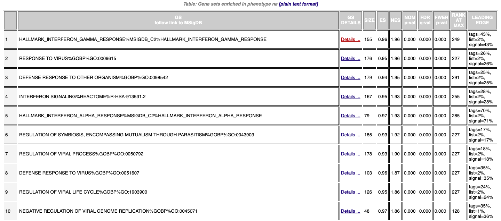
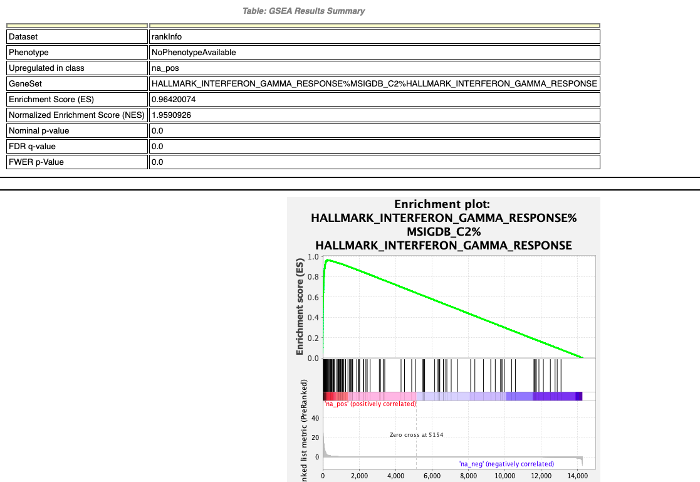
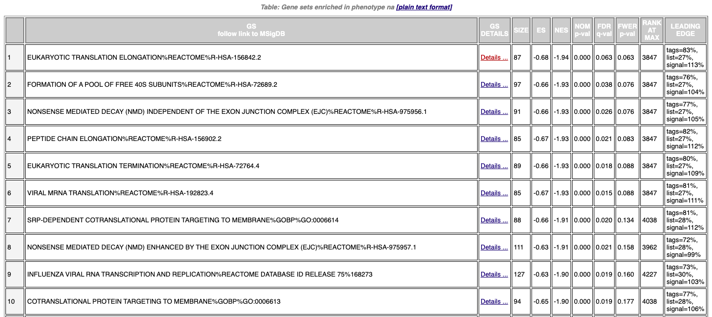
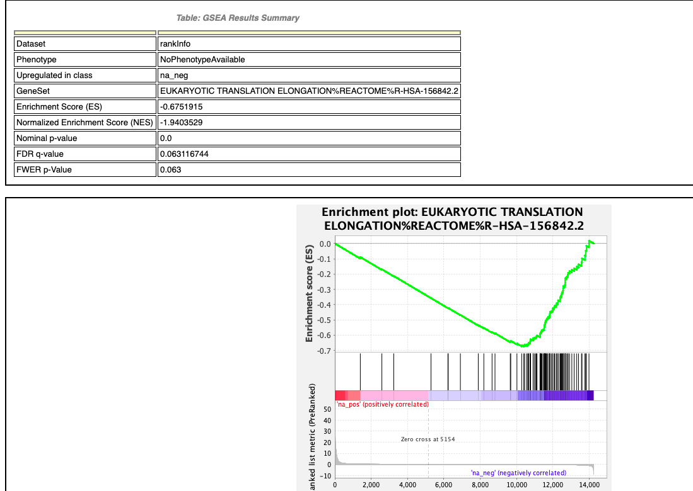
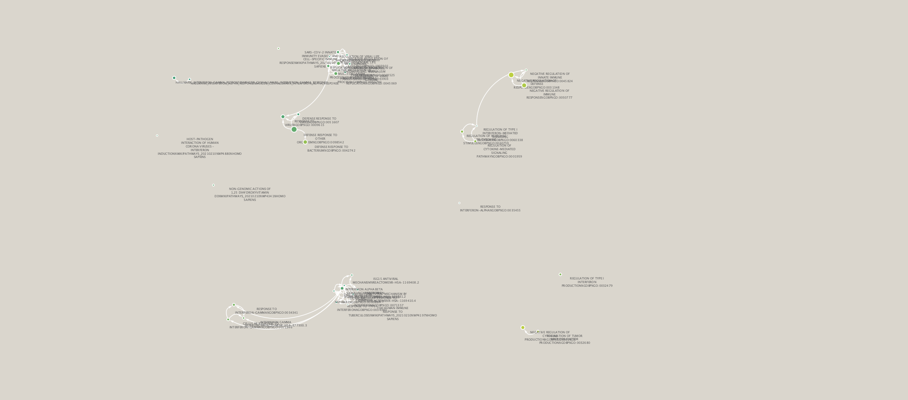
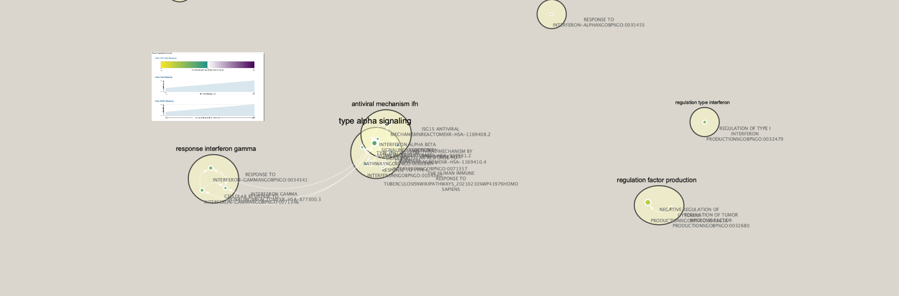

```{r warning=FALSE, message=FALSE, echo=FALSE, include=FALSE}
if (!requireNamespace("BiocManager", quietly = TRUE))
    install.packages("BiocManager")

if (!requireNamespace("RCurl", quietly = TRUE))
    install.packages("RCurl")

if (!requireNamespace("GEOquery", quietly = TRUE))
    install.packages("GEOquery")

library(RCurl)
library(GEOquery)

```
# Overview of past assignments

## Dataset information

```{r, message=FALSE, warning=FALSE, results=TRUE}
gse <- getGEO("GSE149050",GSEMatrix=FALSE)
data.frame(head(Meta(gse)))
```


```{r, message=FALSE, warning=FALSE}
suppFiles = GEOquery::getGEOSuppFiles('GSE149050')
fnames = rownames(suppFiles)
exprDat = read.delim(fnames[1],header=TRUE,
                    check.names = FALSE)

```

The dimensions of my dataset are: `r dim(exprDat)`. There are thus 56269 genes and 288 samples in my dataset, ignoring the first column as it just tells us that the rows are gene names.

In my dataset, there are two kinds of samples based on the study description. The first kind of sample is IFNneg and the second kind of sample is IFNpos. IFpos represents presence of interferon response signature and IFneg represents the healthy control group.

Healthy control group: 85
Systemic lupus erythamtosus (SLE): 203


Additionally, normalization and scoring of genes was done to return the top most differentially expressed genes. We will now look at the top hits in more detail by performing non-thresholded GSEA rather than ORA.


# Non-thresholded GSEA

**Please note that to run this analysis, you must also use the "hits.Rds" file**

Ok, let's start by performing non-thresholded GSEA. First, we need to get the ranking. I've saved it as an Rds file from Assignment 2 so let's load that first and we can create the .rnk file by extracting the rank information from the object.


```{r warning=FALSE, message=FALSE, echo=FALSE}

hits <- readRDS(file="./hits.Rds")

hits$hgnc_symbol <- rownames(hits)

rankinfo <- hits[c("hgnc_symbol", "rank")]

write.table(x=rankinfo,
            file=file.path("data","rankInfo.rnk"),sep = "\t",
            row.names = FALSE,col.names = FALSE,quote = FALSE) # save the table to a .rnk file
```


```{r warning = FALSE, message = FALSE}
gmtUrl = "http://download.baderlab.org/EM_Genesets/March_01_2021/Human/symbol/" 
filenames = getURL(gmtUrl)
tc = textConnection(filenames)
contents = readLines(tc)
close(tc)
# get the gmt that has all the pathways and does not include terms inferred from
# electronic annotations(IEA) start with gmt file that has pathways only
rx = gregexpr("(?<=<a href=\")(.*.GOBP_AllPathways_no_GO_iea.*.)(.gmt)(?=\">)", contents, 
              perl = TRUE)
gmtFile = unlist(regmatches(contents, rx))
dest = paste0(getwd(), "/data/genesets.gmt")
download.file(paste(gmtUrl, gmtFile, sep = ""), destfile = dest) # save the file
```


Now that I have the required files, I will run GSEA now. I am using the desktop application for Mac to run it and with mostly all the default parameters. I chose to use the GSEA preranked method as that was what I was the most familiar with that we did in the homework assignment. The only parameter I have changed is the number of genesets returned. I decreased the default number of 500 to 200 in hopes of retrieving more accurate results as mentioned in lecture. I left the default value of number of genesets returned to still be 15. 


The following is a summary of the results of my GSEA analysis:

## GSEA Summary

The summary below has been split up into two sections. One for upregulated genes, and the other for downregulated genes. 

### Upregulated Genes



**Name** : HALLMARK_INTERFERON_GAMMA_RESPONSE%MSIGDB_C2%HALLMARK_INTERFERON_GAMMA_RESPONSE




### Downregulated Genes



**Name** : EUKARYOTIC TRANSLATION ELONGATION%REACTOME%R-HSA-156842.2
 



# Cytoscape Enrichment Map

In the initial analysis there are 38 nodes and 66 edges. To do the primary enrichment map, I kept all default parameters except the FDR which I set to 0.05. 

Pre-annotated EM:


*Figure 1: Enrichment Model*

Annotated network:

I kept all of the default parameters to construct my network. I just created singleton clusters as to not lose any important information.


*Figure 2: Publication Image*

After collapsing the network into a theme network there were a few themes present. These themes are related to interferon beta signalling which is expected as the findings that the original scientists show that interferon response is part of a fundamental defense against viral infections (Ronnblom Leonard, 2019). Additionally, the results produced by Cytoscape show about the same info as the ORA analysis done in the previous assignment as the major groups presented in the EM are part of the top genesets returned from GO analysis.

# Post-Analysis

Presently, known treatments for systemic lupus erythematosus often include the prescription of antimalarials such as hydroxychloroquine (Plaquenil) and chloroquine (Aralen) but it may take months before antimalarial drugs improve lupus symptoms (Bartels, 2019). Cyclophosphamide is used for immunosuppression in cases of serious SLE organ involvement, especially severe CNS involvement, vasculitis, and lupus nephritis (Medications to treat lupus, n.d.). I want to get a better look at what other options there may be for targeting SLE for less severe cases of SLE. I want to see if there is any other overlap between drugs and the gene sets returned in the enrichment map to see if 1) the current antimalarial treatments show up and 2) what other treatment options there may be. I am going to look at experimental drugs only as this will be an exploratory analysis and I just want to see what comes up, if anything. I am downloading the gmt file from the baderlab.


GMT file I am downloading: *http://download.baderlab.org/EM_Genesets/current_release/Human/symbol/DrugTargets/Human_DrugBank_experimental_symbol.gmt*


```{r warning = FALSE, message = FALSE}
gmtUrl = "http://download.baderlab.org/EM_Genesets/March_01_2021/Human/symbol/DrugTargets/" 
filenames = getURL(gmtUrl)
tc = textConnection(filenames)
contents = readLines(tc)
close(tc)
# get the gmt that has all the pathways and does not include terms inferred from
# electronic annotations(IEA) start with gmt file that has pathways only
rx = gregexpr("(?<=<a href=\")(Human_DrugBank_experimental_symbol*.)(.gmt)(?=\">)", contents, 
              perl = TRUE)
gmtFile = unlist(regmatches(contents, rx))
dest = paste0(getwd(), "/data/expdrugs.gmt")
download.file(paste(gmtUrl, gmtFile, sep = ""), destfile = dest) # save the file
```

Out of all the drugs available in the experimental drugs gene sets, I saw that 11 passed the Mann-Whitney 2-sided test and overlapped my created network. I saw that the most overlap was with zinc sulphate. It had 97 genes in its set. This is interesting to point out because zinc sulphate is actually used in the treatment of ulcers of SLE (Wang, n.d.). 


# References

Christie M Bartels, M. (2021, April 03). Systemic lupus Erythematosus (SLE) MEDICATION: ANTIMALARIALS, NSAIDs, DMARDS, Immunomodulators, RHEUMATOLOGICS, Other, Corticosteroids, DMARDs, Other. Retrieved April 12, 2021, from https://emedicine.medscape.com/article/332244-medication

Duncan Temple Lang (2020). RCurl: General Network (HTTP/FTP/...) Client Interface for R. R package version 1.98-1.2.
  https://CRAN.R-project.org/package=RCurl

Medications used to treat lupus. (n.d.). Retrieved April 12, 2021, from https://www.lupus.org/resources/medications-used-to-treat-lupus#:~:text=The%20two%20types%20of%20antimalarials,are%20rare%20and%20usually%20mild.


Wang, F. (n.d.). ZINC IN THE TREATMENT OF CHRONIC LEG ULCERS OF SYSTEMIC LUPUS ERYTHEMATOSUS. Retrieved from http://smj.sma.org.sg/2303/2303smj9.pdf


